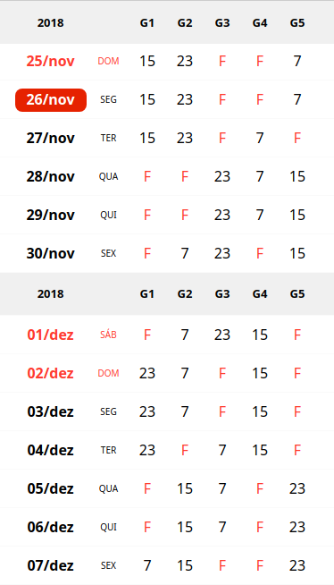

# Tabelaturno.github.io

📅 ⏲️ Shift work table in a static web page.

  

Small Link: [https://tabelaturno.github.io](https://tabelaturno.github.io?utm_source=github_READMEmd)
Small Link: [https://tabelaturno.github.io/TabelaTurno](https://tabelaturno.github.io/TabelaTurno?utm_source=github_READMEmd)

This is the second version, using reactjs library. The project is under development.

## Todos

* Menu 😬
* More tables (with dinamic load)
* Work with hash links (react-router)
* Themes (with dark theme)
* ...

## About author

* **[Angelo Araujo](https://github.com/angww/)**

Want to contribute? You are wellcome.
